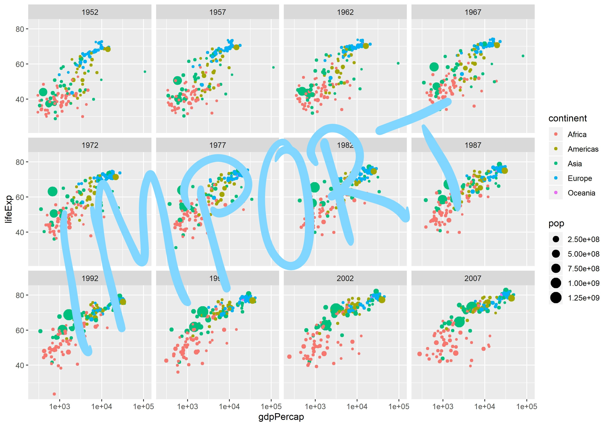

```{r setup, include=FALSE}
knitr::opts_chunk$set(echo = FALSE)
```

```{r packages, message=FALSE, warning=FALSE}
# install.packages("tidyverse")
library(tidyverse) 
# install.packages("gapminder")
library(gapminder)
#install.packages("kableExtra")
#install.packages("knitr")
```


## R Markdown

This is an R Markdown presentation. Markdown is a simple formatting syntax for authoring HTML, PDF, and MS Word documents. For more details on using R Markdown see <http://rmarkdown.rstudio.com>.

When you click the **Knit** button a document will be generated that includes both content as well as the output of any embedded R code chunks within the document.

## Slide with Bullets

- Bullet 1
  - Subbullet 1
  - Subbullet 2
- Bullet 2
- Bullet 3

## Write and Read Data

```{r echo=TRUE}
write.csv(x = gapminder,
          file = "Data/gapminder_data.csv")

gapminder_data <- 
read.csv(file = "Data/gapminder_data.csv", 
         header = TRUE, 
         sep = ",", 
         dec = ".")

head(gapminder_data)
```


## Slide with R Output

```{r cars, echo=TRUE}
summary(cars)
```

## Slide with Kable Table

```{r paged.print=TRUE}
kableExtra::kable(head(mtcars), digits = 1)
```


## Slide with Plot

```{r pressure}
plot(pressure)
```

## Slide with GGPlot

```{r fig.height=7, fig.width=10}
ggplot(data = gapminder) +
  geom_point(mapping = aes(x = gdpPercap,
                           y = lifeExp,
                           size = pop,
                           color = continent)) +
  facet_wrap(~year) +
  scale_x_log10() 

ggsave(filename = "Figures/GGplot.jpg")
```

## Imported GGplot


```{r}

```

